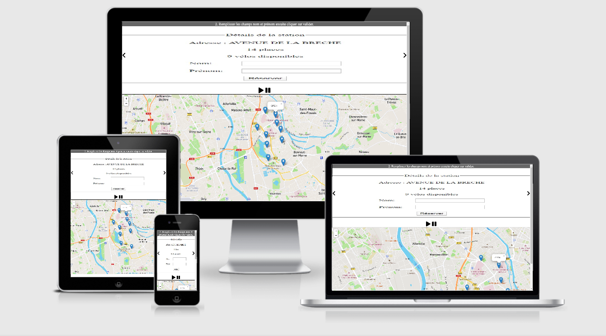

# Velolib Projet 3 (OpenClassrooms)
>Développement d'une application en Javascript Orientée Objet de type Single page Application simulant la réservation de vélos dans une ville. La localisation et l'état de chaque station est fourni par via l'API JC Decaux et la carte est fourni par l'API de cartographie LeafletJS.
>
>[Velolib](https://velolib.psamelhori.fr/)

* L'utilisateur doit pouvoir réserver un vélo depuis son navigateur (à condition qu'il reste des vélos disponibles à la station).
* Afficher une carte avec la liste des stations de location de vélos disponibles dans la ville.
* Afficher en haut de la page un diaporama de photos et de textes expliquant le fonctionnement de l'application.
* Le diaporama passe automatiquement à la diaporama suivante toutes les 5 secondes. L’utilisateur peut toutefois choisir de mettre le diaporama en pause. Il peut également reculer ou avancer manuellement à l’aide d’un clic de souris, ainsi qu’avec les touches gauche et droite de son clavier.
* Une carte affichant en temps réel la liste des stations de location de vélos ainsi que leur disponibilité.  La localisation de toutes les stations de vélos est affichée à l’aide de marqueurs.
* Un clic sur un marqueur affiche l’état de la station dans un panneau construit en HTML et CSS à côté de la carte.
* Il doit être possible de réserver un vélo disponible à la station.
* Une fois la réservation validée,  un vélo est marqué comme réservé à cette station.
* L'état de la réservation (s’il y en a une) est ainsi affiché, avec un décompte dynamique du temps restant avant expiration de la réservation.
* Une réservation expire automatiquement au bout de 20 minutes et également lorsque le navigateur web se referme.
* Il ne peut y avoir qu'une réservation à la fois. Si une nouvelle réservation a lieu, elle remplace la précédente.

## Screenshots
